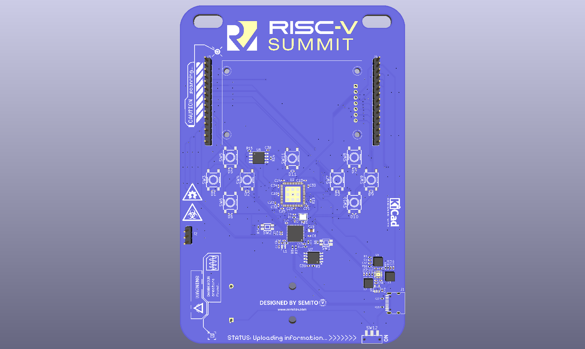
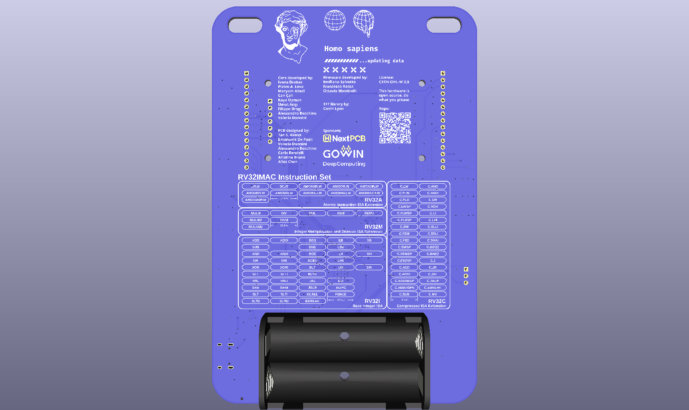

# RISC-V Summit Europe 2026 Badge

Electronic badge PCB for RISC-V Summit Europe 2026 in Bologna, Italy. Designed in KiCad 10.

## Gallery

- Render of the badge on KiCad
  
  

## License

This open source hardware project is licensed with [CERN-OHL-W](LICENSE).
