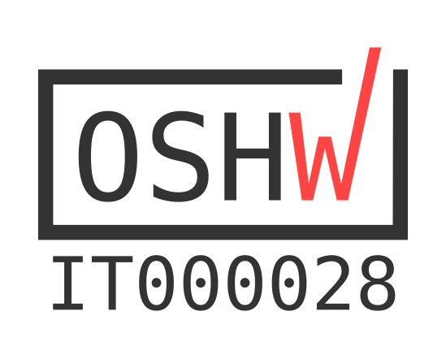

# RISC-V Summit Europe 2026 Badge

Electronic badge PCB for RISC-V Summit Europe 2026 in Bologna, Italy. Designed in KiCad 10.

## Gallery

- Render of the badge on KiCad
  
  

## License and Credits
Designed by: [Tan Siret Akıncı](https://github.com/tansiret), [Emanuele De Paoli](https://github.com/Irdyad), [Carlo Bendelli](https://github.com/CALIOSTRO7), [Valerio Donnini](https://github.com/Valerio-Donnini) and [Alessandro Bocchino](https://github.com/AleB-04).
This open source hardware project is licensed with [CERN-OHL-W](LICENSE). The project is sponsored by © 2026 [RISC-V International](), [NextPCB](https://www.nextpcb.com/), [GOWIN Semiconductor](https://www.gowinsemi.com/en/) and  [DeepComputing](https://deepcomputing.io/).
The project has been certified by [OSHWA](https://oshwa.org/) as Open Source Hardware (UID: [IT000028](https://certification.oshwa.org/it000028.html)).
 

